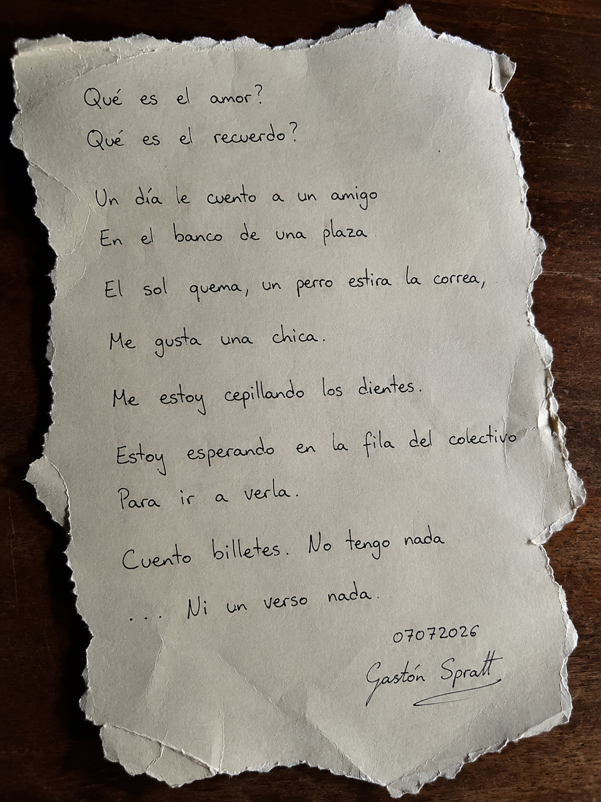
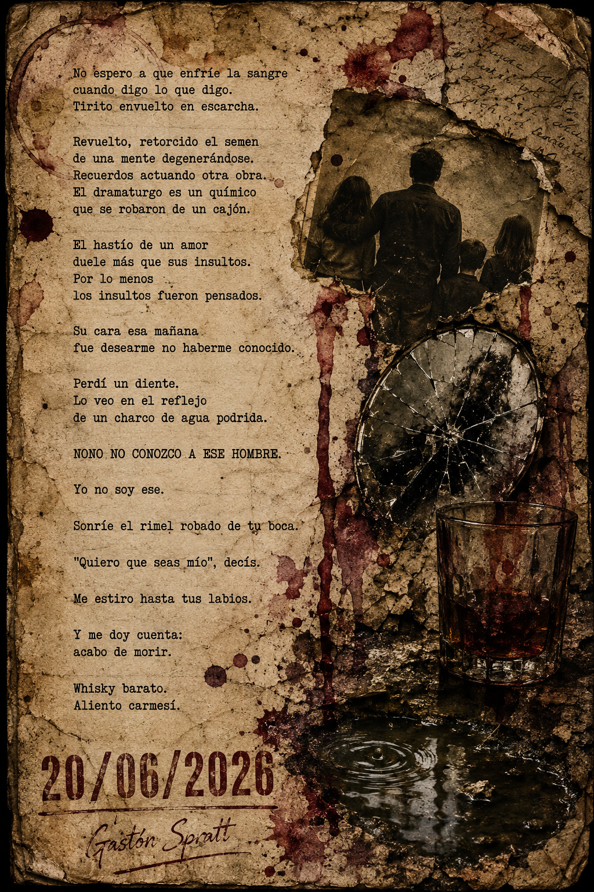
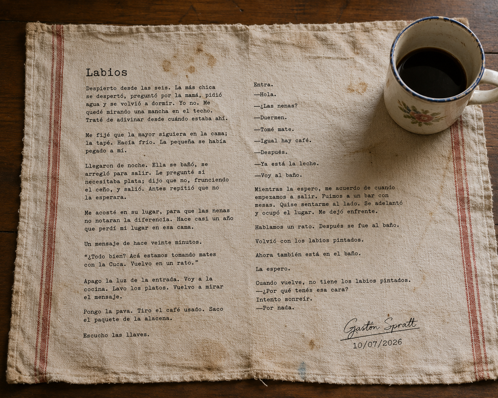
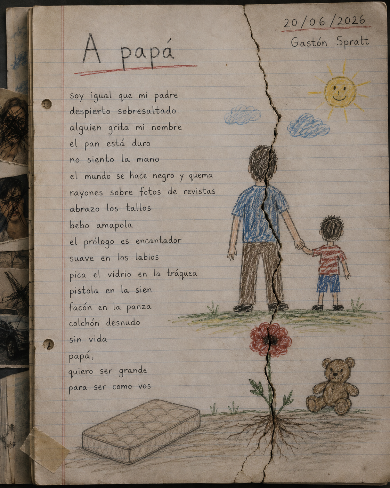

<section class="section">

// FIN DEL REGISTRO

La colección permanece abierta.

Cada nueva pieza amplía el archivo y conserva una huella del momento en que fue creada.

Estado

<strong>ACTIVO</strong>

Piezas públicas

<strong>04</strong>

Próxima actualización

<strong>EN PROCESO</strong>

<blockquote>

La memoria escribe fragmentos. El tiempo decide qué permanece.

</blockquote>

</section>

</main>

<footer>

FRAGMENTO CERO · ALUCINACIONES · GASTÓN SPRATT

</footer>

</body>

</html>

<article class="work-card">

PIEZA_0001

POEMA

<h3>

¿Qué es el amor?

</h3>

Una reflexión poética sobre el amor, la entrega y la fragilidad de los vínculos humanos.

<a href="que-es-el-amor.html" class="button">

Abrir pieza →

</a>

</article>

<article class="work-card">

PIEZA_0002

POEMA

<h3>

Yo no conozco a ese hombre

</h3>

Una mirada íntima sobre la identidad, la distancia y el reconocimiento de uno mismo.

<a href="no-conozco-a-ese-hombre.html" class="button">

Abrir pieza →

</a>

</article>

<article class="work-card">

PIEZA_0003

CUENTO

<h3>

Labios

</h3>

Un relato breve construido a partir del deseo, el recuerdo y la tensión entre lo dicho y lo imaginado.

<a href="labios.html" class="button">

Abrir pieza →

</a>

</article>

<article class="work-card">

PIEZA_0004

POEMA

<h3>

A Papá

</h3>

Un poema dedicado a la memoria, los afectos y las huellas que permanecen a través del tiempo.

<a href="a-papa.html" class="button">

Abrir pieza →

</a>

</article>

</section>

<section class="section">

02

<h2>ESTADO DEL ARCHIVO</h2>

// REGISTRO DE COLECCIÓN

<table class="record-table">

<tr>

<td>Colección</td>

<td>Alucinaciones</td>

</tr>

<tr>

<td>Piezas públicas</td>

<td>04</td>

</tr>

<tr>

<td>Formatos</td>

<td>Poesía · Cuento · Imagen literaria</td>

</tr>

<tr>

<td>Estado</td>

<td>Activo</td>

</tr>

<tr>

<td>Nivel de acceso</td>

<td>Público</td>

</tr>

<tr>

<td>Próxima actualización</td>

<td>En proceso</td>

</tr>

</table>

</section>

<section class="section">

03

<h2>SOBRE LA COLECCIÓN</h2>

Alucinaciones reúne piezas literarias independientes nacidas de diferentes momentos creativos. Poemas, cuentos y composiciones visuales conviven dentro de un mismo archivo donde cada obra conserva su identidad propia.

A diferencia de los proyectos narrativos principales, estas piezas funcionan como registros íntimos: fragmentos de memoria, observaciones y experiencias transformadas mediante la escritura.

El archivo permanece abierto. Nuevas piezas podrán incorporarse cuando encuentren su forma definitiva.

</section>

<section class="section">

04

<h2>FIN DEL REGISTRO</h2>

// COLECCIÓN ABIERTA

Las piezas reunidas en Alucinaciones representan distintos momentos del proceso creativo. Cada una conserva una mirada particular sobre la memoria, la identidad y la experiencia humana.

El archivo continuará incorporando nuevas obras a medida que encuentren su forma definitiva.

Estado

<strong>ACTIVO</strong>

Piezas públicas

<strong>04</strong>

Última actualización

<strong>2026</strong>

<blockquote>

Algunas historias buscan convertirse en mundos. Otras solo necesitan existir una vez para dejar una huella.

</blockquote>

</section>

</main>

<footer>

FRAGMENTO CERO · ALUCINACIONES · GASTÓN SPRATT

</footer>

</body>

</html>
